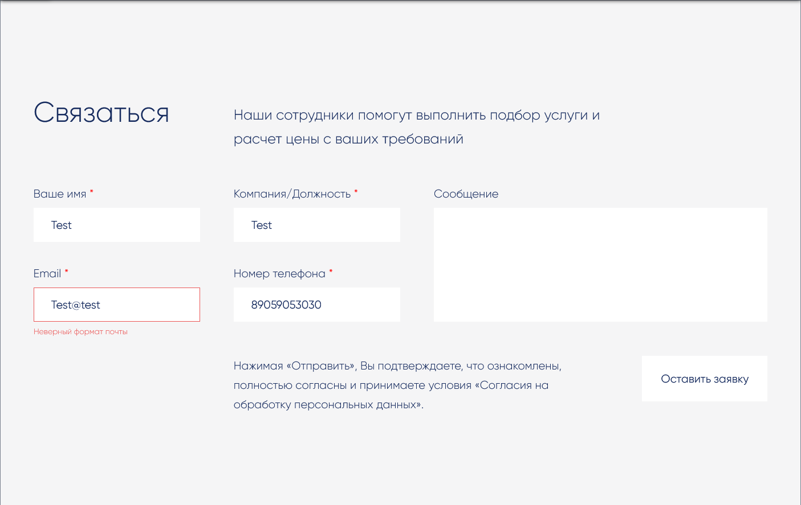

# Задание 2
> ### [ Сертификат прохождения тестов "Администратор. Базовый" ](readme/Контент-менеджер.pdf)
> ### [ Сертификат прохождения тестов "Администратор. Модули" ](readme/Контент-менеджер.pdf)

> ### [Файл шаблона form.result.new - ``local/templates/only_tasks/components/bitrix/form.result.new/form.result.new/template.php`` ](local/templates/only_tasks/components/bitrix/form.result.new/form.result.new/template.php)

> ### Скриншот
> 